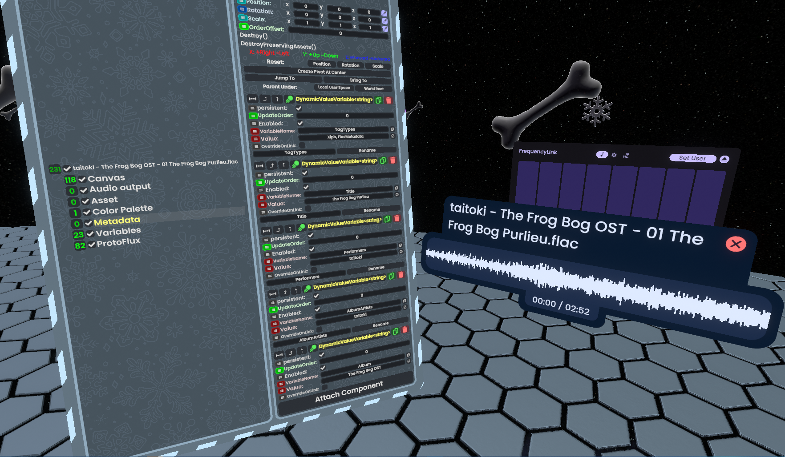

# MetadataImporter

A [ResoniteModLoader](https://github.com/resonite-modding-group/ResoniteModLoader) mod for [Resonite](https://resonite.com/) that imports metadata alongside audio files.

When you import an audio file, the mod looks for a Slot named "Metadata" beneath the root of your audio entity interface. That slot is then filled with Dynamic Variables containing the metadata from the audio file. If [TagLibSharp](https://github.com/mono/taglib-sharp) can read it, this mod will expose it.
 If a Slot named Metadata doesn't exist, the mod will add one on its own.

Useful if you like to import your music into the game, you can make an entity interface that displays the proper metadata (like artist, album, etc) rather than just a filename.

## Entity Interface Config

The mod has a couple of Dynamic Variables it looks for to determine how to do the import:

- `MetadataImporter.Separator` (string): What separator should be used when converting multiple entries into a string? Default: ` ,`
- `MetadataImporter.CastToStrings` (bool): Should the mod forcibly output strings, instead of using the canonical types? Default: `false`

These variables should be bound to the Dynamic Variable Space on the root of your audio entity interface.

## Intercompatibility

This mod has been confirmed to work with files imported through [ResoniteMP3](https://github.com/AwesomeTornado/ResoniteMP3), and [CommunityBugFixCollection](https://github.com/ResoniteModdingGroup/CommunityBugFixCollection/)'s "Import Multiple Audio Files" patch.

Also, if your entity interface implements the Resonite MetaDisc (Res-MD) standard, the mod can detect that and fill in the proper fields.
 Res-MD is still a work-in-progress, there'll be a link to the wiki page once it's complete!

## Screenshots

## Installation
1. Install [ResoniteModLoader](https://github.com/resonite-modding-group/ResoniteModLoader).
2. Place [MetadataImporter.dll](https://github.com/noblereign/MetadataImporter/releases/latest/download/MetadataImporter.dll) into your `rml_mods` folder. This folder should be at `C:\Program Files (x86)\Steam\steamapps\common\Resonite\rml_mods` for a default install.
3. Place [TagLibSharp.dll](https://github.com/noblereign/MetadataImporter/releases/latest/download/TagLibSharp.dll) into your `rml_libs` folder. This folder should be at `C:\Program Files (x86)\Steam\steamapps\common\Resonite\rml_libs` for a default install.

You can create those folders if they're missing, or if you launch the game once with ResoniteModLoader installed it will create those folders for you.

4. Start the game. If you want to verify that the mod is working you can check your Resonite logs.

## Third-Party Libraries

This mod is powered by [TagLibSharp](https://github.com/mono/taglib-sharp), which is under the [LGPL-2.1](https://github.com/mono/taglib-sharp/blob/da41dc30756189217624d8fdde3c70956e7341f9/COPYING) license.